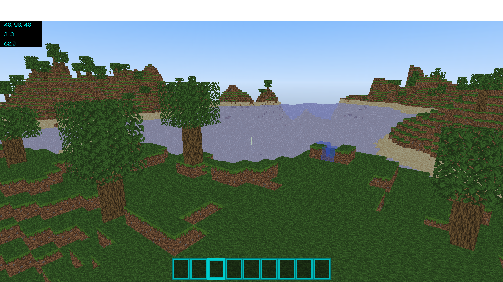

# Minecraft

A minecraft clone built using LWJGL.

## Table of Contents

- [Images](#images)
- [Todo](#todo)

## Images

## Todo

- [x] Implement a meshing algorithm that makes use of face culling.
- [x] Make use of indirect rendering techniques when rendering the terrain.
- [x] Make use of persistently mapped buffers when rendering the terrain.
- [x] Enable vertex data compression.
- [x] Implement order independent transparency (OIT). 
- [x] Implement a skybox.
- [x] Implement raycasting.
- [ ] Implement collision detection.
- [x] Implement chunk serialization/deserialization.
- [x] Make use of multi-threading/concurrency when loading and meshing chunks.
- [x] Setup HUD. (Still not 100%)
- [x] Implement generic renderer.
- [ ] Implement entity renderer.
- [x] Fix font renderer.
- [ ] Implement lighting system.
- [ ] Implement lightweight immediate mode GUI.
- [x] Implement inventory system.
- [ ] Implement menus.
- [ ] Add animations.
- [ ] Implement a particle system.
